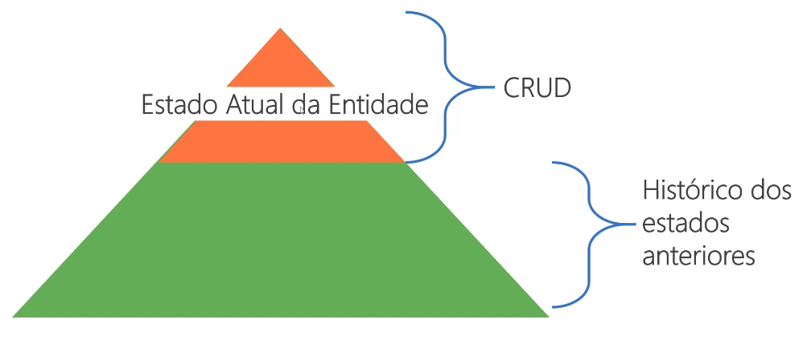

# Event Sourcing
> Nós podemos buscar o estado de uma aplicação para encontrar o estado atual do mundo, e isso responde muitas perguntas. Entretanto, há momentos que nós não só queremos ver onde nós estamos, mas também queremos saber como chegamos lá - Martin Fowler
> Event Sourcing assegura que todas as mudanças feitas no estado de uma aplicação são armazenas como uma sequẽncia de eventos. Não só podemos buscar esses eventos, mas também podemos usar esse log de eventos para reconstruir estados passados e ajustar automaticamente o estado atual com mudanças retroativas - Martin Fowler
* A ideia central é persistir todos os estados anteriores de uma entidade de negócio desde o momento de sua criação, com estes dados é possível realizar o replay dos fatos passados para entender o comportamento do usuário, trabalhar com Big Data, Machine Learning, realizar testes de integração com cenários reais ou simplesmente recriar as entidades se necessário

* Para a grande maioria das aplicações os dados que modificam uma entidade não são persistido. ex: em uma entidade de usuário cujo nome "João" em algum momento mudou para "Pedro"
* Para a grande maioria das aplicações apenas o topo existe (estado atual)

## Fatores essenciais
* Todos os eventos dizem sobre o que houve no passado
* Eventos são uma expressão da línguagem ubíqua
* Não são imperativos e utilizam verbos no passado
* Eventos são sempre adicionados, nunca excluídos
* É possível realizar o replay para conhecer o estado anterior da entidade
* Recomendado o uso de um **Event-base Data Store** (um banco apenas para eventos) ex: [Event Store](https://eventstore.com/)
